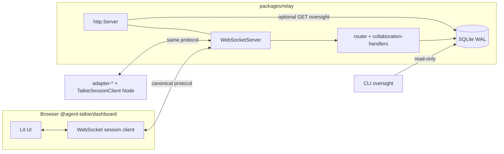

# Web Dashboard — Architecture Integration Research

**Scope:** How a v2.0 real-time web dashboard attaches to the existing relay + SQLite stack.  
**Researched:** 2026-04-17  
**Confidence:** **HIGH** for current relay/client/persistence behavior (verified in repo); **MEDIUM** for product choices (static hosting shape, optional HTTP surface).

---

## 1. Integration points (explicit)

| Integration point | Location in codebase | Role for dashboard |
|-------------------|----------------------|--------------------|
| **Single HTTP server + WebSocket** | `packages/relay/src/server.ts` — `http.createServer()` + `WebSocketServer({ server })` | Same origin/port for `wss://` and (optionally) dashboard static files or REST. Health path today: `GET /__agent-talkie/v1/health` when generation token set. |
| **Handshake + session binding** | `server.ts` (`handshake`, `session.register` / `session.resume`) | Browser must perform the same pre-envelope flow as `@agent-talkie/client` (`TalkieSessionClient`): versions, then register/resume, then envelopes. |
| **Dispatch pipeline** | `dispatchValidatedEnvelope` → space join/leave, `handleCollaborationControl`, `routeEnvelope` | Human dashboard session receives **fan-out** conversation envelopes, **`transcript.catchup`** on join, **`collaboration.orchestrator`**, **`collaboration.metadata`**, and control responses (`orchestrator.designated`, `metadata.query.result`, `transcript.query.result`, etc.). |
| **Transcript durability + live line** | `packages/relay/src/router.ts` — `appendTranscriptEntry` after routing (with skip set for `space.join`, `space.leave`, `transcript.query`, `metadata.query`) | Live updates = envelopes on WS; history/pagination/search backend = **`transcript.query`** (capped server-side, `listTranscriptEntriesAfterSeq`). |
| **Collaboration metadata** | `packages/relay/src/collaboration-handlers.ts` | **`metadata.query`** → `metadata.query.result` with `getCollaborationMetadataSnapshot`; **`metadata.patch`** → DB + **`collaboration.metadata`** fan-out to other members. |
| **Oversight-shaped reads (CLI parity)** | `packages/persistence/src/repositories/oversight.ts` — `getOversightSpaceSummaryBySlug`, `listOversightTranscriptTailBySlug`, `listOversightBlockedSessionsBySlug` | Used today by CLI (`packages/cli/src/oversight/*`). Browser **cannot** call these directly (no filesystem SQLite). Relay (or a co-located process with same `dbPath`) must expose equivalent data over **HTTP or new WS control messages**. |
| **Space lifecycle** | `packages/relay/src/space-lifecycle.ts` — `handleSpaceJoin` / `handleSpaceLeave` | **Create** space is implicit via **join by slug** (create/revive/replace). Destroy/archive flows are persistence + relay rules, not a separate “REST create space” today. |
| **Shared types / validation** | `@agent-talkie/protocol` (Zod, envelopes) | Dashboard TS should import protocol types/schemas for outbound envelopes and inbound parsing — **browser-safe** (Zod + `uuid`; no Node-only APIs in published entry). |

---

## 2. Recommended answers to design questions

### 2.1 New package `@agent-talkie/dashboard`?

**Yes.** Treat the dashboard as its own workspace package:

- **Contains:** Lit components, Vite app entry, styles, routing (if any), and thin **browser** networking code.
- **Depends on:** `@agent-talkie/protocol` (types + `safeParseEnvelope` / schemas as needed).
- **Does not depend on:** `@agent-talkie/persistence`, `better-sqlite3`, or Node `ws` — keeps the bundle small and avoids leaking server-only APIs into the UI build.

`@agent-talkie/client` today is **Node-oriented** (`ws`, `randomUUID` from `node:crypto` in `session-client.ts`). The dashboard should use the **native `WebSocket` API** and either:

- a small **`browser-session.ts`** inside `@agent-talkie/dashboard` that mirrors the handshake/register/join sequence, or  
- a future **`@agent-talkie/client-web`** (or dual export from `client`) if multiple browser consumers appear.

Either way, **wire format stays the canonical relay protocol** — no parallel “dashboard dialect.”

### 2.2 Serve static UI from the relay process vs separate server?

**Hybrid (recommended for this monorepo):**

| Mode | Behavior |
|------|----------|
| **Development** | Vite dev server for `@agent-talkie/dashboard` with **proxy** of `/` or `/api` → relay HTTP (if added) and `ws://127.0.0.1:<port>` for WebSocket (or upgrade proxy). Matches PROJECT.md “Lit + Vite” reference. |
| **Production / CLI “open dashboard”** | Option **A (preferred for zero-extra-service):** extend the relay’s existing `http.Server` to serve **prebuilt static assets** from `dashboard/dist` (or embed) under e.g. `/` or `/app`, single listen address `LISTEN_HOST` (`127.0.0.1`). Option **B:** `npx`/`talkie` spawns two processes (relay + static) — more moving parts, only if you want strict separation. |

**Rationale:** Relay already owns the only long-lived listener the product guarantees; co-locating static files avoids CORS and extra ports while staying localhost-only.

### 2.3 WebSocket: human session via protocol vs dashboard-specific protocol?

**Use the existing protocol as a human session** for anything that mutates collaboration state or must respect **membership, owner, orchestrator** rules (implemented in `collaboration-handlers.ts` and `router.ts`).

- **Do not** invent a parallel dashboard WebSocket protocol for control paths — you would duplicate authorization and drift from adapters.
- **Optional narrow extension:** add **read-only** HTTP or WS **query** messages that are thin wrappers around persistence (e.g. “list active spaces for this data dir”) if product needs a space picker without guessing slugs. Today there is **no** `listSpaces` in `@agent-talkie/persistence` exports; CLI is **slug-targeted**. That gap is a deliberate integration todo, not a reason to bypass the relay.

Non-envelope server messages already used for UX (`transcript.catchup`, `collaboration.orchestrator`, `collaboration.metadata`, query results) remain **server → client JSON** alongside parsed envelopes — the dashboard parser should handle **both** `safeParseEnvelope` success paths and these **typed side-channel** payloads (similar to `TalkieSessionClient.dispatchPostHandshake`).

### 2.4 SQLite for read operations: direct vs API?

| Consumer | Access pattern |
|----------|----------------|
| **CLI** | Direct `openDatabase` + `getOversightSpaceSummaryBySlug` etc. (validated v1 decision). |
| **Browser** | **No direct SQLite.** Reads go through **relay** (or supervisor if you ever centralize HTTP there — not current default). |

**Concrete patterns:**

1. **Already on WebSocket (member):** `transcript.query`, `metadata.query` — no new surface required for transcript pages and metadata snapshot.
2. **Oversight summary / blocked list / multi-space listing:** implement **HTTP GET** on the relay’s HTTP handler (same DB handle as WS) reusing `oversight.ts` queries, **or** add protocol control types that return the same JSON. HTTP is often simpler for **initial page load** and caching headers; WS is fine for **everything** if you prefer one channel.

### 2.5 Real-time updates: subscribe vs poll SQLite?

**Subscribe via WebSocket** as a joined session:

- **Conversation + most control** → `routeEnvelope` fan-out (and `appendTranscriptEntry` keeps durability in sync).
- **Orchestrator changes** → `fanOutOrchestratorUpdate` (`collaboration.orchestrator`).
- **Metadata patches** → `collaboration.metadata` to other members.

**Do not poll SQLite from the browser.** Optional **slow poll** of HTTP snapshot is only a fallback for debugging or if WS is down — not the primary model.

**Search/filter UX:** maintain an in-memory index of transcript entries loaded via **`transcript.query` with cursors** (`afterSeq`, capped `limit`); on new live envelopes, append and filter client-side. For very large histories, repeat queries with increasing `afterSeq` (server already caps at 500 per request in `router.ts`).

### 2.6 Lit web components — component architecture

Suggested **layering** (logical packages inside `@agent-talkie/dashboard/src`):

| Layer | Responsibility | Examples |
|-------|----------------|----------|
| **Shell / routing** | URL ↔ selected space slug, layout | `talkie-app`, optional lightweight router |
| **Session bridge** | WebSocket lifecycle, reconnect, idempotency keys, envelope dispatch | `talkie-session-controller` (non-visual) or a small controller class |
| **Space & members** | Member list, orchestrator badge, owner hints | `talkie-roster`, `talkie-orchestrator-panel` |
| **Transcript** | Virtualized list, filters, live tail | `talkie-transcript`, `talkie-entry` |
| **Topology** | Graph derived from `to` fields + roster (MVP) | `talkie-topology` — may need heuristics; not a first-class DB table today |
| **Controls** | Send message, designate/clear orchestrator, join/leave slug | `talkie-composer`, `talkie-space-actions` |

Use **@lit/task** or a tiny state store for async loads (initial `metadata.query`, `transcript.query` pages). Share **Zod-validated** view models where the protocol already defines payloads.

---

## 3. Data flow (end-to-end)



**Write path (human action):** UI → construct `Envelope` / join/register (protocol) → relay validates membership + owner rules → SQLite + fan-out.  
**Read path (cold load):** UI → HTTP snapshot (if implemented) **or** `metadata.query` + `transcript.query` over WS after join → render.  
**Read path (live):** relay pushes envelopes + side-channel JSON events → UI merges into local state.

---

## 4. Package structure (suggested)

```
packages/
  dashboard/                 # NEW — Vite + Lit, publishable or CLI-bundled static
    src/
      app, components/, lib/session-bridge.ts
  relay/                     # EXTEND — optional static middleware + optional REST
  client/                    # OPTIONAL LATER — browser export or split client-web
  protocol/                  # unchanged dependency for dashboard
  persistence/               # unchanged; relay continues to own DB handle
```

**CLI:** add a subcommand (e.g. `talkie dashboard`) that ensures daemon is up, opens browser to `http://127.0.0.1:<port>/` (or prints URL). Implementation can mirror supervisor’s relay lifecycle.

---

## 5. Build order (respects dependencies)

1. **`@agent-talkie/protocol`** — already stable; add any **Zod schemas** for server JSON side-channels only if you choose to centralize parsing (optional).
2. **Browser session bridge** — handshake + register/resume + join + dispatch loop; unit-test with mock WebSocket or relay integration test.
3. **`@agent-talkie/dashboard` skeleton** — Vite + Lit + one screen (connect + show roster from `metadata.query.result` + tail from live messages).
4. **Relay HTTP extensions (as needed)** — static file serving from `dashboard` build output; optional `GET` endpoints wrapping `oversight.ts` for slug discovery or multi-space list **if** you add `listRecentSpaces`-style queries to persistence.
5. **Feature-vertical slices** — transcript search client-side; orchestrator controls (reuse envelopes); topology visualization; invite/remove (depends on protocol milestones — verify against current `space.*` and membership rules).
6. **CLI wiring** — `talkie dashboard`, asset path resolution for `npx` installs.

---

## 6. Gaps and research flags

| Gap | Notes |
|-----|-------|
| **No global “list spaces” API** | Persistence is slug-centric for oversight. Space picker / “all spaces” needs new queries + relay exposure. |
| **Topology** | No dedicated table; derive from traffic + roster or add telemetry later. |
| **`@agent-talkie/client` Node-only** | Dashboard must not depend on `ws` as used today; mirror protocol steps in browser. |
| **Auth** | v2.0 remains localhost-only per PROJECT.md; no TLS — acceptable for static+WS on loopback. |

---

## 7. Sources

- `packages/relay/src/server.ts`, `router.ts`, `collaboration-handlers.ts`, `catch-up.ts`, `space-lifecycle.ts`
- `packages/client/src/session-client.ts`, `packages/client/package.json`
- `packages/persistence/src/index.ts`, `repositories/oversight.ts`
- `packages/cli/src/oversight/static-commands.ts`, `watch.ts`
- `.planning/PROJECT.md` (v2.0 Web Dashboard milestone)
