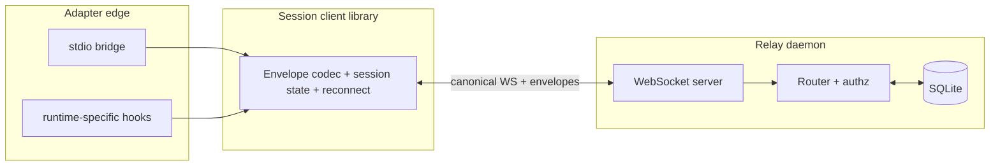

# Architecture Research: Cross-Runtime Agent Collaboration Layer

**Domain:** Local-first, WebSocket-relay-based, multi-session collaboration  
**Researched:** 2026-04-10  
**Confidence:** MEDIUM — synthesizes product constraints (`PRD.md`, `ARCHITECTURE-CONSTRAINTS.md`, `.planning/PROJECT.md`) with common distributed-session patterns; exact schemas and auth are still open per constraints doc.

---

## Standard Architecture

### System Overview

The default system is a **small, always-addressable relay process** (the **relay daemon**) that:

1. Accepts **WebSocket** connections from **sessions** (and later other clients such as human-facing surfaces).
2. Authorizes joins per **collaboration space** (channel) and **session identity** (first-class, stable within the product model).
3. Validates every inbound frame as a **versioned message envelope** (e.g. Zod in TypeScript; JSON Schema derived for other runtimes).
4. Persists **collaboration metadata and durable protocol state** to **SQLite** (not optional for the default path).
5. **Routes** envelopes to the right recipients: by space membership, explicit addressing, and protocol semantics — **without** requiring an orchestrator process to be on the hot path for every peer message.

**Local vs remote** is **deployment only**: same wire protocol, same envelope semantics. Local default = relay on `localhost`; remote = relay reachable over the network. No second “mode” architecture.

**Ingress** from native runtimes (stdio bridge, extension, subprocess) lives in **adapters** that terminate in the same **session client** speaking WebSockets to the relay. Adapters are not an alternate core transport.

**Control vs conversation** are **message kinds** (or layered payloads inside one envelope), not separate transports or servers. The relay treats them uniformly at the transport level: validate, authorize, persist where required, deliver.



### Component Responsibilities

| Component | Responsibility | Must not |
|-----------|------------------|----------|
| **Relay daemon** | Own WS listener; connection lifecycle; envelope validation; space/session authz; routing; SQLite writes/reads for metadata and protocol durability; optional idle shutdown policy | Become “the orchestrator” or interpret agent task semantics beyond collaboration rules |
| **Protocol module** | Versioned envelope types; Zod parse; JSON Schema export; idempotency keys where specified; evolution strategy (version negotiation or reject) | Encode transport-specific framing (e.g. stdio packetization) as core truth |
| **Session client** | Session identity; connect to relay URL; heartbeat/presence if defined; outbound queue; inbound dispatch; reconnect with cursor/seq | Depend on a particular runtime UI |
| **Supervisor / launcher** | Ensure relay process exists before sessions connect; pick port/socket; avoid “first session owns relay”; idle detection hooks | Block on a human manually starting infra in the default path |
| **Adapter (per runtime)** | Map native process I/O or APIs ↔ session client; optional local buffering | Reimplement routing or persistence; bypass envelope validation on the relay |
| **Orchestrator (logical role)** | Assigned per space; receives default human-originated traffic per product rules; coordinates **by sending messages** like any session | Required intermediary for all session↔session chat (relay must support direct addressing) |

**Boundary rule:** Anything that must work the same on localhost and a remote host belongs in **protocol + relay + session client**. Anything that depends on Cursor vs Codex vs Claude Code belongs in **adapters**.

---

## Recommended Project Structure

Opinionated monorepo-style layout (names illustrative):

```text
packages/
  protocol/           # envelope, Zod schemas, idempotency helpers, JSON Schema build
  relay/              # daemon entrypoint, WS server, router, SQLite access
  client/             # session WebSocket client, reconnect, backpressure
  supervisor/         # spawn/health/idle policy; shared with CLI
  adapters/
    stdio/            # line/JSON-RPC or framed JSON → client
    <runtime>/        # optional thin wrappers
apps/
  cli/                # npx entry: join, ensure relay, print URL/status
```

**Suggested build order (dependency order):**

1. **`protocol`** — envelopes, versioning, validation; pure logic, no I/O. Unblocks every consumer and contract tests.
2. **`relay` persistence shell** — SQLite migrations + repositories for spaces, memberships, session registry, message/transcript pointers as designed. Relay can initially log-only for messages if needed, but metadata tables should land early.
3. **`relay` networking** — WebSocket server accepting connections, performing handshake + auth token/model, binding connection → session id.
4. **`client`** — connect, subscribe to space, send/receive envelopes, reconnect with last acknowledged sequence (exact resume policy TBD).
5. **`supervisor`** — “ensure relay”: spawn if absent, single instance per user/machine convention (lockfile or local socket path), health probe, **idle shutdown** when no WS connections for N seconds (policy TBD in `ARCHITECTURE-CONSTRAINTS.md` open questions).
6. **`adapters`** — stdio first (debuggable, universal), then runtime-specific shims that embed or shell out to the client.

Rationale: protocol and persistence errors are expensive to fix late; adapters are the most variable and should consume a stable client API.

---

## Architectural Patterns

### Independent relay process (not “first peer is host”)

Use a **dedicated daemon** started by **supervisor**, not by “whoever connected first.” The first session has **no special process ownership** of the relay. Sessions are **clients**; relay **survives** their churn until idle policy or explicit stop.

### Hub-and-spoke transport, mesh collaboration semantics

**Transport topology** is star-shaped (each session ↔ relay). **Collaboration semantics** remain peer-capable: the relay **routes** envelopes to one or many recipients; orchestrator is a **role**, not the only hub for content.

### Single canonical protocol stack

Local and remote differ only by **relay base URL** and **trust/auth** configuration. Avoid bifurcating codepaths into “local mode” vs “remote mode” beyond connection parameters and policy.

### Envelope-in, envelope-out

Adapters decode enough to form a **valid envelope**; the relay is the **authoritative validator**. Clients may pre-validate for faster fail-local, but relay must re-validate.

### Session identity first-class

Stable **session id** (and display name policy per PRD) is carried in connection handshake and/or every envelope as required by protocol version. Membership in a space is a **relation** between session and space in SQLite, not an implicit property of a transport handle alone.

### Control vs conversation in the same pipe

Represent as **discriminated payload** inside the envelope (e.g. `kind: "control" | "conversation"` or nested `body`). Routers may apply different **authorization rules** (who may issue control) without separate infrastructure.

---

## Data Flow

### Join path

1. Human/session initiates **join** via adapter or CLI → **supervisor** ensures relay is listening.
2. **Session client** opens WebSocket to relay; **handshake** presents credentials/invite token, proposed **session id** or server-assigned id, target **space id**.
3. Relay **authorizes** (policy TBD), writes/updates **SQLite** membership row, acknowledges.
4. Relay may **fan out** a presence/control envelope to other members.

### Message path (session A → session B)

1. Adapter delivers user/agent content → client wraps in **versioned envelope** (conversation or control per semantics).
2. Client sends over **WebSocket**; relay **parses + validates** (Zod server-side mirror).
3. Relay applies **authorization** (sender in space? allowed to address B? orchestrator-only for certain control types?).
4. Relay **persists** if required (metadata patch, transcript append pointer, idempotency record).
5. Relay **delivers** to B’s connection(s) — and optionally to subscribers of a human-visible feed — without forcing path through orchestrator unless product rule says so for that **message type**.

Direction is always **client → relay → client(s)** for default architecture; there is no session-to-session TCP shortcut in v1, keeping NAT and firewall story simple.

### Human / orchestrator default routing

Product rule: “human to space → orchestrator by default” is a **routing convention** implemented by **clients** (who they address) and/or **relay rules** for undirected human messages — not by making the orchestrator the WS termination point for all traffic.

---

## Relay Daemon Lifecycle

### Spawn

- **Trigger:** first need for collaboration (e.g. CLI `join`, adapter connect, or explicit start). **Supervisor** checks local lock/health; if relay dead or absent, **spawn** child process with configured data dir (SQLite path) and listen address.
- **Single instance:** enforce with OS-level mutex (lockfile) or abstract socket so two relays do not fight for the same DB.
- **Bootstrap:** relay opens SQLite, runs migrations, binds WebSocket port (ephemeral or fixed per user config).

### Running

- Accept connections; enforce TLS optional for remote (deployment concern); authenticate.
- **No dependency** on any particular session remaining connected; space may exist with zero sessions until idle teardown policy.

### Idle shutdown

- Track **active WebSocket connections** and optionally **debounced work** (pending writes). If zero connections for **T** seconds, **graceful shutdown**: stop accept, drain, flush SQLite WAL if used, exit.
- Next activity **respawns** relay via supervisor — **sessions** use **exponential backoff reconnect**; they do not become the new host.

### Reconnect

- Client reconnects with same **session identity** and last **sequence / cursor** if protocol defines it; relay **rehydrates** subscriptions from SQLite and resumes delivery from durable cursor or best-effort memory buffer (policy TBD).

This satisfies: **relay lifecycle not tied to one participant**, **first session not permanent special host**.

---

## Adapter Ingress (Native Runtimes)

Adapters sit **outside** the core transport:

- **stdio bridge:** parent process spawns child session client or speaks framed JSON over stdin/stdout; bridge runs inside IDE terminal or agent wrapper.
- **in-process:** runtime loads a small library that uses the same **session client** API (WebSocket).
- **sidecar:** separate Node process next to the agent, adapter talks localhost IPC then client to relay.

**Contract:** adapter’s job is **faithful envelope construction** and **ordering** as visible to the agent; relay’s job is **validation and routing**. Adapters may batch or compress only if the **envelope stream** semantics remain clear (avoid hiding idempotency boundaries).

---

## Scaling Considerations

| Scale | Pressure | Direction |
|-------|----------|-----------|
| Few sessions, one machine | SQLite + single relay process is sufficient | Default path |
| Many messages | SQLite write batching; optional append-only segment files for transcript with SQLite index | Keep metadata in SQLite per constraints |
| Remote teams | Same relay binary; deploy behind TLS terminator; auth becomes critical | Still zero *vendor* dependency; self-hosted relay |
| Large fan-out | Relay CPU for fan-out; consider per-space read models later | Not v1 blocker for coding-agent volumes |

**Out of scope for default path:** external message buses, hosted Firebase-style realtime DBs — see `ARCHITECTURE-CONSTRAINTS.md`.

---

## Anti-Patterns

| Anti-pattern | Why it fails constraints / product | Instead |
|--------------|-----------------------------------|---------|
| First connected session spawns embedded relay | First session becomes special host; relay dies with it | Supervisor-spawned daemon + shared lock |
| Orchestrator WS endpoint required for all peer messages | Orchestrator as relay bottleneck | Direct addressing in protocol; orchestrator as role |
| stdio as canonical transport | Blurs adapter vs core; harder remote parity | WebSocket canonical; stdio only in adapters |
| Separate control plane TCP server | “Control” as transport concept | Control messages as envelope kinds |
| JSON files as sole source of truth | Violates SQLite default store | SQLite durable; JSON/JSONL export optional |
| Peer-to-peer WebRTC for default | Complex NAT, divergent from “relay on localhost vs remote” | Relay-mediated WS default |
| Implicit LAN discovery = join | Violates explicit opt-in / invite | Network presence ≠ membership |

---

## Integration Points

| Integration | Role |
|-------------|------|
| **npm / npx CLI** | Invokes supervisor; prints relay URL; kicks off adapter helpers |
| **SQLite file** | Single-tenant default; path per OS user or workspace (decision pending) |
| **Invite / token model** (TBD) | Becomes part of handshake validation in relay |
| **Human UI** (future) | Another WebSocket client using same protocol |
| **Harnesses / AGENTS.md** (PRD) | Higher layer; consume collaboration via adapters, not vice versa |

---

## Roadmap / Phase Hints

- Early phases: protocol envelopes + relay accept loop + SQLite schema skeleton + one reference adapter (stdio).
- Mid: supervisor idle lifecycle + reconnect semantics + idempotency for retried deliveries.
- Later: remote hardening (TLS, token rotation), richer metadata queries, export mirrors.

---

## Sources

| Source | Use in this doc |
|--------|-----------------|
| `.planning/PROJECT.md` | Requirements, simplifications (one space per session v1), constraint alignment |
| `PRD.md` | Session-first model, orchestrator responsibilities, human routing expectations |
| `ARCHITECTURE-CONSTRAINTS.md` | Hard constraints, default architecture, open design questions (auth, exact schema, idle T) |
| Common practice: **star topology relay**, **daemon supervision**, **hub validates** — not proprietary to a single library | Lifecycle and separation-of-concerns patterns |

**Gaps (explicit):** exact SQLite tables; handshake auth; idle timeout values; transcript vs metadata split; orchestrator failover when role holder disconnects (`PRD.md` open question) — flagged in `ARCHITECTURE-CONSTRAINTS.md` and intentionally left as phase-level design work.
