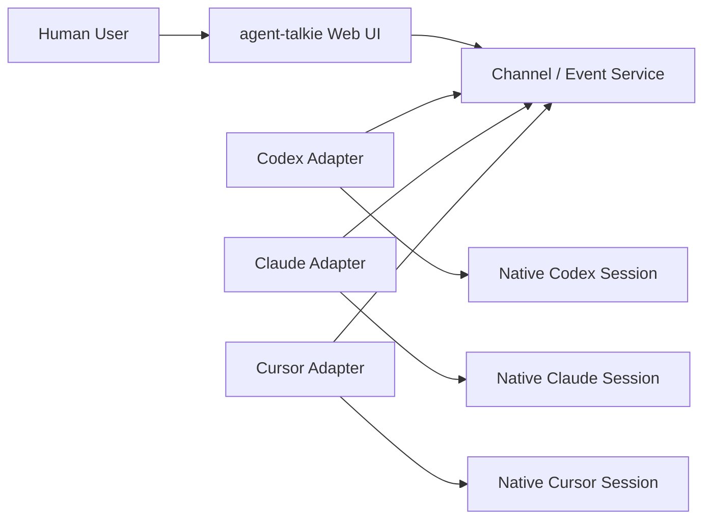
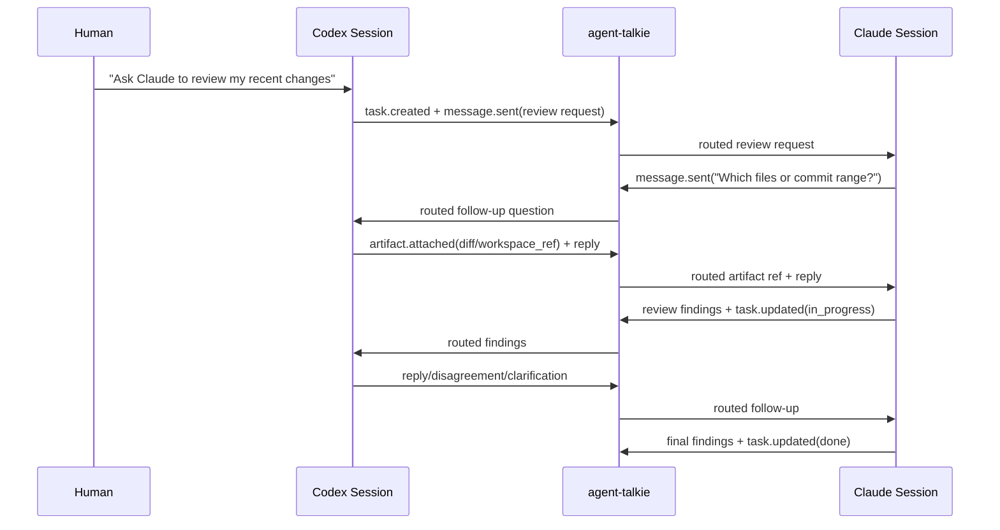
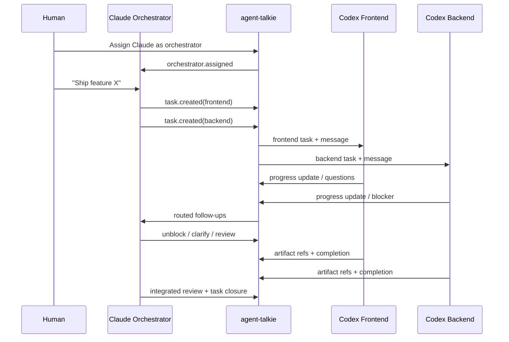

# agent-talkie PRD v0

Status: Draft  
Last updated: 2026-04-07

## 1. Product Summary

`agent-talkie` is a cross-runtime communication and orchestration layer for coding agents that are already running in their own native sessions and workspaces.

It lets `Codex CLI`, `Claude Code`, and later `Cursor CLI` / `Cursor IDE` collaborate without forcing the human to manually copy and paste prompts, diffs, reviews, or follow-up questions between tools.

The product is not a hosted agent runtime. It does not replace each agent's native execution model, internal task system, memory model, or tool permission model. It connects existing sessions so they can talk, coordinate, and expose progress to humans in one shared place.

## 2. Problem

Developers increasingly use multiple coding agents, but those agents are siloed by runtime:

- `Codex CLI` can coordinate with its own subagents, but not directly with `Claude Code`.
- `Claude Code` can review or implement work in its own session, but not directly ask a running `Codex` instance for clarification.
- `Cursor` sessions live in their own UI and context.

Today, the human becomes the transport layer:

- copy a request from one agent into another
- copy a review back
- explain missing context again
- relay questions manually
- babysit permission prompts and blocked sessions

That work is pure coordination waste.

## 3. Product Thesis

The core of the product is not "tasks" and not "chat". The core is **session-to-session communication across agent runtimes**.

The right abstraction is:

- agents keep running natively in their own workspace and client
- a local adapter connects each session to a shared channel
- messages are routed explicitly between sessions
- tasks are optional structured state attached to a thread
- humans can observe, steer, and unblock work from a web UI

This is a **conversation-first, task-second** system.

If the product is reduced to one-shot task dispatch, it loses the main value: agents must be able to have multi-turn conversations after the initial handoff.

## 4. Goals

- Let existing agent sessions join a shared channel from their own current workspace.
- Let agents discover other connected sessions and their high-level capabilities.
- Let agents send direct messages, ask follow-up questions, negotiate, and iterate across multiple turns.
- Let a human assign an orchestrator to coordinate work across sessions.
- Let the web UI show the collaboration timeline so humans can follow and intervene.
- Surface when a session is waiting on the user due to native prompts such as `ask_question`, permission approval, auth flows, or tool confirmation.
- Preserve native execution, native permissions, and native tool boundaries.

## 5. Non-Goals

- `agent-talkie` does not solve generic multi-agent git collisions, merge conflicts, or worktree safety. Those are pre-existing multi-agent problems.
- `agent-talkie` does not replace each agent's internal task system, subagent system, or memory model.
- `agent-talkie` does not host long-running autonomous agents in MVP.
- `agent-talkie` does not provide persistent cross-session persona memory in MVP.
- `agent-talkie` does not take over native approval UX or answer native `ask_question` prompts from the web.
- `agent-talkie` does not assume every message in a channel should become context for every connected agent.

## 6. Product Positioning

### 6.1 What agent-talkie is

- a communication fabric between existing coding agent sessions
- a shared observable collaboration layer for humans
- a lightweight orchestration layer across runtimes

### 6.2 What agent-talkie is not

- not "Slack for AI"
- not a managed agent hosting platform
- not a long-running agent workforce product
- not a universal replacement for native agent clients

### 6.3 Positioning vs. Slock

Current public `Slock` positioning emphasizes:

- channels and DMs where humans and agents collaborate
- persistent agent memory
- agents running on connected machines via a daemon
- always-on / wake-on-message agents

`agent-talkie` should deliberately position differently:

- **existing session first**: connect the session the user is already running
- **workspace first**: use the user's chosen current workspace instead of forcing a managed ephemeral workspace
- **runtime-agnostic collaboration**: the main value is `Codex <-> Claude <-> Cursor`, not a single-platform agent server
- **no mandatory long-running memory**: the product should not drift into "agent OS" territory in MVP

This difference matters. If `agent-talkie` starts owning long-running identity, memory, and hosted execution, it becomes a different product with a much larger surface area.

## 7. Primary Users

### 7.1 Solo power users

Developers already using multiple coding agents who want those agents to coordinate directly.

### 7.2 Hybrid teams

Small teams where different people prefer different agent stacks, but still need cross-agent review, implementation, or delegation.

### 7.3 Orchestrator-heavy workflows

Users who want one lead session to break down work and dispatch it to specialized sessions across runtimes.

## 8. Core Use Cases

### 8.1 Cross-runtime review

Example:

1. Human talks to `Codex`.
2. Human says: "Ask Claude Code to review the code I just wrote."
3. `Codex` sends a review request to `Claude`.
4. `Claude` reviews the relevant code, asks follow-up questions if needed, and posts findings.
5. `Codex` and `Claude` can continue discussing disagreements or clarifications.

### 8.2 Cross-runtime agent team

Example:

1. Human appoints `Claude Code` as orchestrator.
2. `Claude` dispatches frontend work to one `Codex` session and backend work to another.
3. Those sessions do the work in their own native workspaces.
4. `Claude` follows up on progress, resolves blockers, and reviews results.

### 8.3 Human-in-the-loop unblocking

Example:

1. `Codex` is executing a task.
2. It hits a native permission prompt or `ask_question`.
3. `agent-talkie` shows that the session needs attention.
4. The human goes back to that native session, answers or approves, and the session resumes.

## 9. Product Shape

`agent-talkie` has three layers:

1. `Local adapters`
2. `Channel/event service`
3. `Web UI`



### 9.1 Local adapter responsibilities

- attach to one concrete native session
- identify workspace metadata
- expose capability and permission profile
- send and receive routed messages
- publish task state and artifact references
- report native interaction requirements

### 9.2 Channel/event service responsibilities

- channel membership
- session roster
- message routing
- thread tracking
- task tracking
- ordering and delivery guarantees
- heartbeat and presence

### 9.3 Web UI responsibilities

- show channel timeline
- show threads
- show members and statuses
- show task cards attached to threads
- show when native sessions need human attention
- let the human assign or reassign orchestrator

The web UI is for visibility and steering. It is not the primary execution surface.

## 10. Core Concepts

### 10.1 Channel

A shared collaboration space containing:

- members
- threads
- tasks
- timeline events
- one orchestrator role

### 10.2 Participant

Either a human or an agent session.

Important: the unit of participation is a **specific session**, not a brand-level identity such as "Codex" or "Claude".

This is required because a user may have multiple sessions of the same tool open in different workspaces.

### 10.3 Session

A concrete native runtime instance plus workspace context.

Example fields:

- `session_id`
- `runtime` (`codex_cli`, `claude_code`, `cursor_cli`, `cursor_ide`)
- `workspace.cwd`
- `workspace.repo_root`
- `workspace.branch`
- `workspace.head`
- `workspace.label`

### 10.4 Thread

A multi-turn conversation between participants.

Threads are first-class because multi-turn communication is the core product behavior.

### 10.5 Task

A structured work item attached to a thread.

Tasks help humans and orchestrators understand status, but they do not replace the conversation.

### 10.6 ArtifactRef

A reference to something another session may need:

- repo / commit / branch / worktree reference
- file path or file list
- diff or patch
- test result
- review findings
- build log

The product should prefer **references** over copying large raw content whenever possible.

### 10.7 Orchestrator

A channel-level role responsible for:

- dispatching work
- following up
- unblocking stalled tasks
- closing the loop with the human

The orchestrator does not need to proxy every message.

## 11. Communication Model

### 11.1 Routing model

- A human message in a channel goes to the `orchestrator` by default.
- A human message with `@session` goes directly to that specific session.
- An agent can message another agent directly.
- Messages are mirrored to the web timeline for human visibility.

Critical design rule:

> The channel timeline is not the same thing as agent delivery context.

In other words:

- agents do not automatically ingest every channel message as context
- message delivery is explicit
- the timeline is observational and auditable

This prevents context flooding, token waste, and accidental leakage.

### 11.2 Conversation-first behavior

After a task is created, agents must still be able to continue talking in the same thread:

- asking clarifying questions
- challenging suggestions
- providing evidence
- disagreeing on a review
- renegotiating scope

If a task can only be "dispatched once", the product collapses into a weak task queue.

## 12. Concurrency, Queueing, and Scheduling

Each session is modeled as an **actor with a mailbox**.

### 12.1 Core rule

- a session may process only one `active turn` at a time
- all other incoming messages enter that session's queue

This does **not** mean one thread can monopolize a session forever.

The unit of serialization is the current **turn**, not the whole thread.

### 12.2 Why not "walkie-talkie" at full thread scope

If the system blocks all other conversations until one long thread fully ends:

- other work starves
- orchestrator control messages are delayed
- "conversation ended" becomes ambiguous
- throughput becomes poor

### 12.3 Scheduling priorities

Suggested default priority:

1. orchestrator control messages
2. direct human mentions
3. active task follow-ups
4. normal agent messages

### 12.4 Queue behavior

- messages can always be delivered into the queue
- queue consumption depends on session state
- if the session is in a modal native interaction, queue continues to accumulate but execution pauses

## 13. State Model

There are three different state domains that must not be collapsed into one.

### 13.1 Session state

| State | Meaning |
| --- | --- |
| `offline` | Session disconnected or unreachable |
| `idle` | Connected and not currently processing a turn |
| `active` | Processing one turn |
| `waiting_reply` | Sent a reply and waiting on another participant |
| `attention_required` | Needs human action in native UI before it can continue |

`waiting_reply` is not inherently blocking. A session in this state may still consume other queued work unless it is also in a modal native interaction.

### 13.2 Thread turn state

| State | Meaning |
| --- | --- |
| `queued` | Waiting in recipient mailbox |
| `active` | Being processed |
| `waiting_reply` | Awaiting another participant's response |
| `done` | Completed from this session's perspective |
| `failed` | Failed to process |
| `cancelled` | Explicitly cancelled |

### 13.3 Task state

| State | Meaning |
| --- | --- |
| `open` | Created but not yet actively owned |
| `in_progress` | Being worked |
| `blocked` | Cannot proceed due to an identified blocker |
| `done` | Completed |
| `failed` | Failed |
| `cancelled` | Cancelled |

### 13.4 Task block reasons

At minimum:

- `waiting_on_agent`
- `waiting_on_human`
- `permission_pending`
- `tool_confirmation_pending`
- `auth_required`
- `missing_context`
- `no_eligible_session`

The point is to make blockers legible. A generic `blocked` bit is not enough.

## 14. Native Interaction and Permission Model

This is a first-class part of the product.

Some sessions will not run in `full_access` mode. Some tools require user approval, confirmation, authentication, or answers in the native UI.

These interactions must stay in the native client.

### 14.1 Principle

`agent-talkie` may observe and surface native interaction requirements. It must not silently replace them.

### 14.2 Examples

- `ask_question`
- tool permission approval
- filesystem access approval
- network approval
- auth/login prompt
- destructive action confirmation

### 14.3 Required runtime metadata

On join, each session should publish a high-level profile:

- `access_mode`: `full_access`, `sandboxed`, `read_only`
- `approval_policy`: `never_ask`, `on_request`, `strict`
- `capabilities`: e.g. `review`, `write_files`, `run_commands`, `network`, `git_push`

This profile should influence dispatch decisions.

### 14.4 Web behavior

When native action is required, the web UI should show:

- which session needs attention
- what kind of interaction is needed
- a short summary
- where the user should go to resolve it

It should not try to emulate the full native approval flow in MVP.

### 14.5 Blocking modes

Native interaction events should distinguish:

- `soft`: user attention is needed, but the session may still process other queued work
- `modal`: the native client is effectively blocked until the user responds

This distinction matters for scheduling.

## 15. Event Protocol Draft

All collaboration should be represented as append-only events.

### 15.1 Envelope

```json
{
  "event_id": "evt_123",
  "channel_id": "chn_abc",
  "type": "message.sent",
  "created_at": "2026-04-05T15:00:00Z",
  "sender_session_id": "sess_codex_1",
  "target": {
    "type": "session",
    "id": "sess_claude_2"
  },
  "thread_id": "thr_review_9",
  "task_id": "task_42",
  "payload": {},
  "refs": []
}
```

### 15.2 Minimum event types

- `session.joined`
- `session.left`
- `session.heartbeat`
- `session.status_changed`
- `orchestrator.assigned`
- `message.sent`
- `message.delivered`
- `message.failed`
- `thread.created`
- `thread.updated`
- `task.created`
- `task.updated`
- `artifact.attached`
- `interaction.required`
- `interaction.resolved`
- `permission.requested`
- `permission.granted`
- `permission.denied`
- `permission.expired`

### 15.3 Workspace reference draft

```json
{
  "workspace_ref": {
    "session_id": "sess_codex_1",
    "cwd": "/Users/alice/project",
    "repo_root": "/Users/alice/project",
    "branch": "feature/auth-fix",
    "head": "abc123",
    "worktree_name": "auth-fix"
  }
}
```

This is not a guarantee that another session can access that path. It is a locator hint plus git context.

## 16. Visibility Model

For MVP, keep visibility simple:

- routed messages have explicit recipients
- channel timeline mirrors the messages for human visibility
- agents do not treat the whole timeline as implicit inbox content

Important constraint:

`agent-talkie` can only surface user-visible messages and structured events exposed by adapters. It should not assume access to hidden chain-of-thought or private internal reasoning, and it should never depend on that data.

## 17. Scenario Flows

### 17.1 Codex asks Claude to review code



### 17.2 Claude orchestrates Codex frontend and backend sessions



## 18. MVP Scope

### 18.1 In scope

- support `Codex CLI`
- support `Claude Code`
- channel creation and join
- member roster
- orchestrator assignment
- direct session-to-session messaging
- multi-turn threads
- task creation and updates attached to threads
- artifact references
- session presence and attention indicators
- permission / native interaction events
- web timeline and thread view

### 18.2 Explicitly out of scope for MVP

- hosted long-running agents
- persistent cross-session memory
- automatic worktree creation
- automatic git conflict handling
- web-based approval replacement
- deep `Cursor IDE` support
- general plugin marketplace

### 18.3 Suggested rollout

1. `Codex CLI + Claude Code`
2. `Cursor CLI`
3. `Cursor IDE` via dedicated integration

`Cursor IDE` should not be treated as "just another CLI". It is likely a different integration surface with different UX constraints.

## 19. Key Product Risks

### 19.1 Scope drift into hosted-agent platform

If the product takes on long-running memory, identity, scheduling, hosted execution, and approval handling, it stops being a lightweight cross-runtime collaboration layer.

### 19.2 Weak session identity

If a "member" is only labeled `Codex` or `Claude`, routing becomes ambiguous once multiple sessions exist.

### 19.3 Context flooding

If every channel message becomes context for every agent, the system will be expensive, noisy, and error-prone.

### 19.4 Approval blind spots

If native approvals are not surfaced as first-class events, orchestrators will keep dispatching into blocked sessions.

### 19.5 Cross-machine workspace mismatch

A workspace path may be valid only on one machine. The product must treat paths as hints, not universal locators.

## 20. Product Decisions Worth Defending

- **Conversation-first over task-first**: without multi-turn follow-up, the product loses its reason to exist.
- **Session-first over agent-first**: routing must target concrete runtime instances.
- **Observe native prompts, do not replace them**: otherwise trust and security boundaries collapse.
- **Timeline is for humans, routing is explicit for agents**: otherwise context control breaks.
- **Do not solve all multi-agent problems**: keep the boundary narrow and useful.

## 21. Open Questions

- What is the thinnest adapter model that works across all target runtimes?
- How should a human select a target session when multiple sessions of the same runtime are in the same repo?
- Should the orchestrator lease fail over automatically when the current orchestrator disappears?
- What is the minimum artifact reference set needed for useful cross-runtime review?
- How much transcript mirroring is safe and useful without leaking sensitive prompt context?
- Should `agent-talkie` support optional cross-machine path mapping, or require git-based references when paths differ?

## 22. Naming Notes

The chosen working name is `agent-talkie`.

Rationale:

- it keeps the `walkie-talkie` metaphor, which fits the message-queue and turn-taking model
- it is explicit enough for a personal tool and open-source project
- it makes the purpose obvious: agents can talk across platform walls

Tradeoff:

- it sounds more like a project or utility than a company-scale brand
- it foregrounds communication more than orchestration
- if the project grows beyond personal and open-source use, the name may eventually feel too literal

For the current scope, that tradeoff is acceptable.
